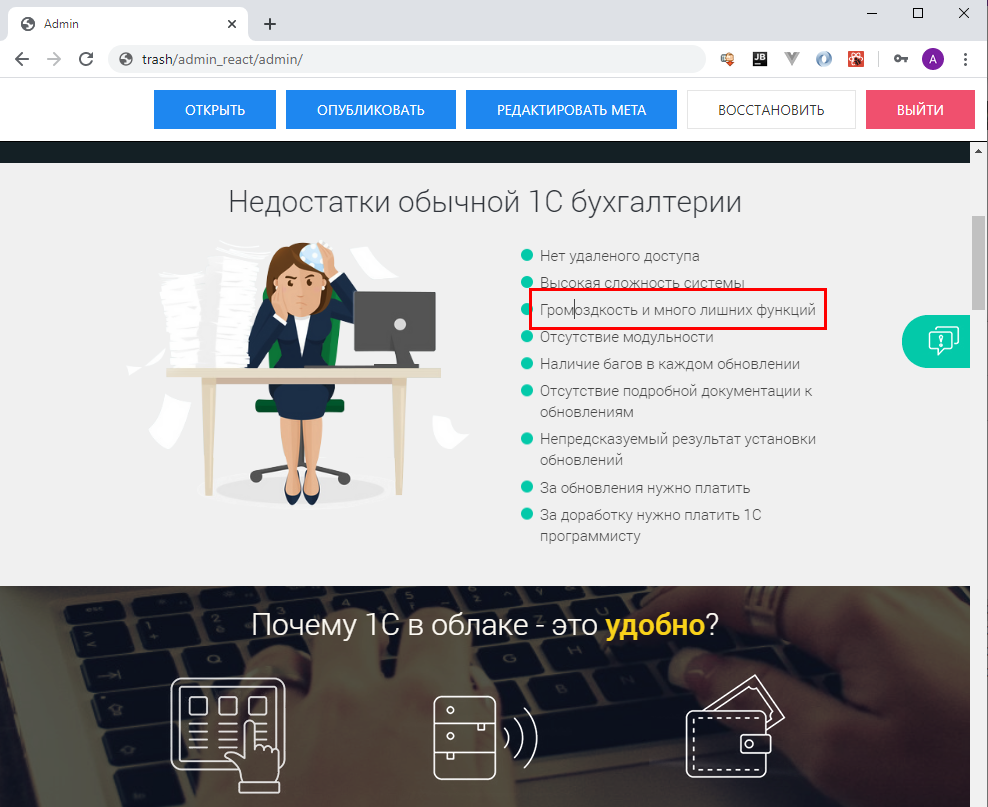

# React Admin
React-приложение написанное в рамках учебного курса ["Создание административной панели на React.js + PHP"](https://www.udemy.com/course/reactjs_admin_panel/).

Представляет из себя универсальную административную панель для небольших статичных сайтов. Является примером приложения, использующего связку **React + PHP**. На текущий момент в административной панели реализованы следующие возможности:

- Переключение между редактируемыми страницами
- Редактирование текстовых элементов по клику ЛКМ
- Редактирование названий ссылок и кнопок по клику ПКМ
- Редактирование изображений по клику ЛКМ
- Редактирование мета-информации (заголовок, keywords, decription)
- Версионный контроль страниц, восстановление из бэкапа
- Аутентификация пользователей

# How to use?

В проекте настроена сборка при помощи связки **Gulp + Webpack**. Для сборки **production-бандла** необходимо выполнить команду:

```
npx gulp prod
```

Далее необходимо переместить содержимое каталога **build/** на сервер в корень вашего статичного сайта в свой собственный каталог.

Для **development-бандла** в **gulpfile.js** в качестве значения для константы **dist** необходимо прописать путь до каталога, в котором административная панель будет располагаться на вашем локальном сервере. Далее для сборки бандла и автоматического перемещения файлов в этот самый каталог необходимо выполнить команду:

```
npx gulp build
```

В режиме разработки так же можно включить отслеживание изменений для фонового перемещения файлов в нужный каталог локального web-сервера. Для этого нужно выполнить команду:

```
npx gulp watch
```

или

```
npx gulp
```

# Example

